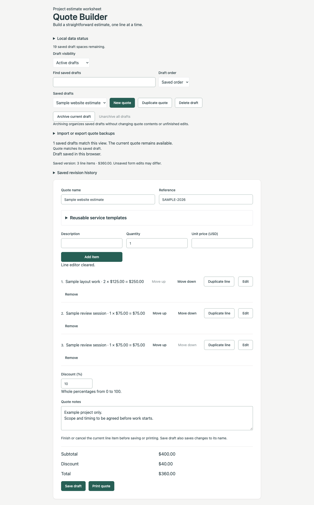

# Tallyleaf

**Estimates, neatly tallied.** Tallyleaf is a browser-local worksheet for turning repeatable services into clear, printable estimates. Build line items, reuse service templates, keep named drafts and revision snapshots, and move quotes or service templates between browsers with validated JSON backups.



## Run

Use Node 20, then:

```sh
npm ci
npm run dev
```

Open `http://localhost:3000`. For a production build, run `npm run build` followed by `npm start`.

## Features

- Capture saved revisions, rename labels, export individual snapshots, and restore independent drafts, even after deleting the source quote.
- Create, edit, duplicate, reorder, and remove quote lines with USD prices calculated in integer cents.
- Apply a whole-number discount from 0–100%; rounding happens once at the discount total.
- Create up to 30 reusable service templates; search, edit, delete, and insert them into quotes.
- Name, reference, search, sort, duplicate, and save up to 20 drafts. Archive drafts to organize active work, filter archive status, or unarchive them without changing their contents.
- Export saved drafts and import validated backups without replacing existing quotes. Identifier and name collisions receive new values.
- Print the quote name, reference, ordered lines, discount, totals, and notes. Editing controls stay off the printout.

Finish a line with **Add item** or **Update item**, or use **Cancel line** / Escape before saving. Changing a quote name and saving renames the draft. Switching quotes asks before discarding unfinished quote edits. Template edits remain available when switching quotes.

## Design

The interface uses shadcn/ui conventions: components under `components/ui/` read HSL design tokens declared as CSS variables in `app/globals.css` and mapped in `tailwind.config.js`.

- **Brand:** the Tallyleaf mark is a leaf whose veins are tally marks (`components/brand.tsx`, `app/icon.svg`). Forest ink (`--primary`) carries actions, brass (`--brass`) marks accents and history, and warm paper (`--paper`) frames the worksheet.
- **Layout:** a Quote library sidebar (drafts, filters, archive, backups, revision history) sits beside a paper-style worksheet with a live running total, a line composer, a tabular item list and a totals summary. It collapses to one column on small screens.
- **Type and icons:** system serif display faces and system sans text, with tabular figures for money. Icons are inline SVGs, so no font or icon package is fetched.
- **Print:** printouts carry a small Tallyleaf header, the ordered lines, right-aligned totals, notes and a "Prepared with Tallyleaf" footer; editing controls stay hidden.

Browser storage keys, backup `kind` values and download filenames keep their original `quote-builder` prefix so existing saved data and backups continue to load.

## Storage and limits

Everything stays in this browser's local storage; there are no accounts, network synchronization, payment processing, or tax services. Reloading discards edits that have not been saved. Clearing site data removes saved drafts, templates, revision history, and archive metadata. Avoid storing sensitive customer information.

Malformed saved data is left untouched. Failed writes are reported as session-only changes. Conflicting writes from another tab are rejected instead of silently overwriting its data. Keep the page open if saving fails; exporting saved drafts also includes drafts held only in the current session.

- **Quote backups:** all saved drafts, including archived quotes, their lines and notes. Imports require confirmation, accept files up to 5 MB, and enforce the combined 20-draft limit. Unfinished edits and service templates are excluded.
- **Template backups:** a separate validated JSON format, limited to 512 KB and 30 templates after merging. Imports assign unused identifiers, distinguish duplicate names, retain unfinished template edits, and permit one file read at a time.
- **Revision history:** five snapshots per source quote and forty overall. Capturing a sixth replaces only that quote’s oldest snapshot; a full shared history requires explicit deletion. Captures use saved contents. Restore creates an independent saved draft; export downloads one snapshot as a standard quote backup, excluding its history label and capture time. There is no whole-history export.
- **Archive metadata:** browser-only organization flags, excluded from all backups. Deleting a draft removes its archive flag while retaining independent revision snapshots for recovery.

The **Local data status** disclosure and each auxiliary panel describe loaded, unreadable, or session-only data. Export session-only quote, template, or revision contents before closing; archive flags have no portable backup.

Each quote permits 100 lines, whole quantities from 1–999, and unit prices from $0–$999,999.99. Notes are limited to 1,000 characters. This remains a small estimate worksheet, not an invoicing or accounting system.

## Verification

```sh
npm test
npm run typecheck
npm run build
```

The domain tests cover money boundaries, draft/template/revision schemas, archive filtering, identifier reservations, backup roundtrips and limits, immutable restoration, and stale-storage protection. CI runs domain tests and the production build with pinned actions and Node 20.18.1.

Browser checks use an externally supplied Playwright runtime. Start the production app, set `QUOTE_TEST_URL` to its URL, then run:

```sh
export QUOTE_TEST_URL=http://localhost:8604
for suite in browser-regressions templates-browser backups-browser worksheet-browser revisions-browser template-portability-browser organization-browser workflow-2026-browser print-2026-browser; do
  node "tests/$suite.cjs"
done
```

The four inherited suites default to port 8504; the five 2026 suites default to 8604. Set the variable explicitly when using another port. They cover real browser persistence, imports and downloads, interrupted edits, storage failures, retained source identities, keyboard recovery, mobile overflow, and print output. The worksheet suite refreshes the sample screenshot.

Local verification used Node 20.19.0 and current Chrome. After the Tallyleaf redesign, the static production build reported 22.5 kB for the root route and 110 kB first-load JavaScript (previously 18.9 kB and 106 kB); these are build measurements, not a claim about page speed on users’ devices.

## Technology and credits

Next.js 14.2.22, React 18.3.1, TypeScript 5.3.3, and Tailwind CSS 3.4.1. The pinned dependencies have known advisories; review and upgrade them before production deployment.

Card, Badge, Textarea and Alert follow the shadcn/ui source patterns; Separator and NativeSelect are dependency-free equivalents that avoid adding Radix packages. Button and Input retain their original shadcn/ui source from revision [`c21ecfb665214e18cd5914ea319f925cd676e786`](https://github.com/shadcn-ui/ui/tree/c21ecfb665214e18cd5914ea319f925cd676e786), under `apps/www/registry/default/ui/`. The upstream MIT license is preserved in [SHADCN-LICENSE.md](SHADCN-LICENSE.md).

## Provenance

Created in September 2026; earlier commit dates were intentionally assigned and do not indicate original development or publication dates.
